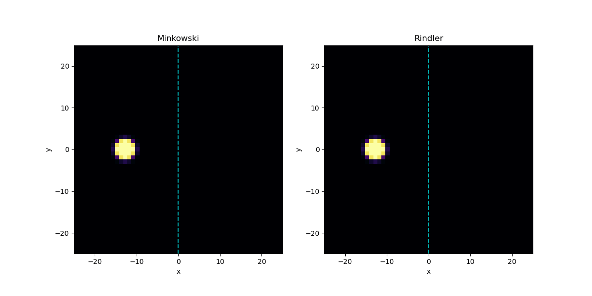

# Numerical Simulation of the Unruh Effect using QuTiP

<div align="center">
  
  <p><em>Time-dependent evolution and field fluctuations during uniform acceleration.</em></p>
</div>


---

### 📌 Overview

This repository contains numerical simulations of the **Unruh Effect** modeled using **QuTiP** (Quantum Toolbox in Python). 

The Unruh effect is a prediction of quantum field theory in curved spacetime: a uniformly accelerating observer in Minkowski vacuum detects a thermal bath of particles at a temperature proportional to their acceleration:

$$T = \frac{\hbar a}{2\pi c k_B}$$

This project models the interaction between an accelerated Unruh-DeWitt detector (two-level quantum system) and a quantum scalar field to observe the resulting excitation probability and thermalization.

---

### 🔬 Simulation Highlights

* ⚛️ **Unruh-DeWitt Detector:** Two-level system interacting with quantum fields along non-inertial trajectories.
* 📈 **Quantum State Dynamics:** Time evolution solved numerically with QuTiP's master equation solvers.
* 🌌 **Thermal Bath Statistics:** Evaluation of field excitations, transition rates, and Planckian distribution profiles.

---

### 📂 Repository Structure

```text
.
├── Figures/                   # Plots and animated GIFs
│   └── wave_animation.gif     # Field excitation animation
├── Unruh_effect.ipynb         # Main simulation notebook
└── README.md                  # Project documentation
